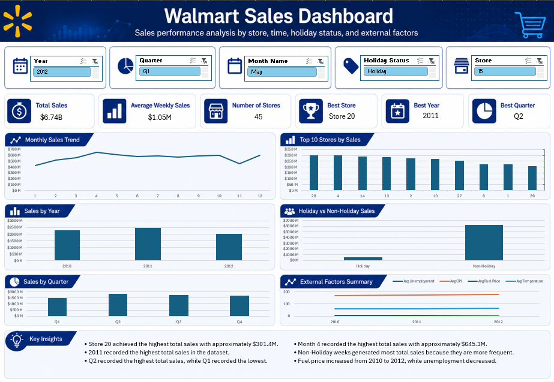
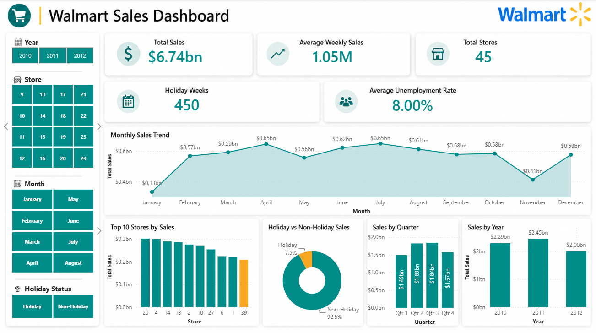

# Walmart Sales Analysis

## Project Overview
This project presents an end-to-end analysis of Walmart weekly sales data using Excel, SQL, Python, and Power BI.

The goal of the project is to analyze sales performance, identify trends, compare store performance, measure holiday impact, and build interactive dashboards for business insights.

## Tools Used
- Excel
- SQL Server
- Python
- Power BI
- GitHub

## Dataset
The dataset contains Walmart weekly sales data from 2010 to 2012.

Main columns include:
- Store
- Date
- Weekly Sales
- Holiday Flag
- Temperature
- Fuel Price
- CPI
- Unemployment

## Key KPIs
- Total Sales: 6.74bn
- Average Weekly Sales: 1.05M
- Total Stores: 45
- Holiday Records: 450
- Average Unemployment Rate: 8.00%

## Project Workflow
1. Cleaned and prepared the data using Excel and Python
2. Imported and analyzed the dataset using SQL Server
3. Performed exploratory data analysis using Python
4. Built interactive dashboards using Excel and Power BI
5. Organized the final project files for GitHub portfolio presentation

## Key Insights
- Total sales reached approximately 6.74bn.
- Store 20 achieved the highest total sales.
- 2011 recorded the highest annual sales in the available dataset.
- Non-holiday weeks contributed the majority of total sales.
- Sales dropped noticeably in November compared to most other months.
- 2012 sales are lower because the dataset ends in October 2012.

## Dashboard Previews

### Excel Dashboard

### Power BI Dashboard

## Project Files
- `Excel/` contains the Excel dashboard and dashboard image.
- `SQL/` contains SQL queries used for analysis.
- `Python/` contains the Python notebook, cleaned dataset, outputs, and charts.
- `PowerBi/` contains the Power BI dashboard file and dashboard image.

## Conclusion
This project demonstrates a complete data analysis workflow, starting from data cleaning and exploration to building interactive dashboards and extracting business insights.
